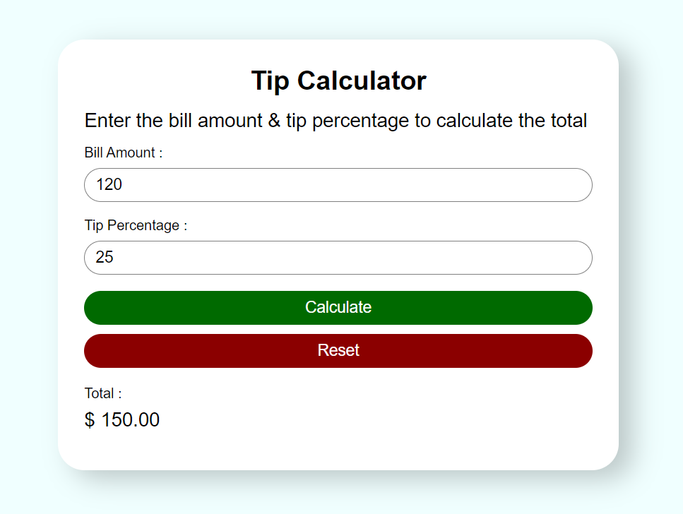

# Tip Calculator

This is a simple tip calculator web application created using HTML, CSS, and JavaScript. The application allows users to input the bill amount and select a tip percentage to calculate the tip amount and the total bill amount.

## Overview

The Tip Calculator is a small web project that helps users quickly and easily calculate tips for their bills. It's a straightforward tool with a clean and user-friendly interface.

## UI 


## How It Works

1. Open the `index.html` file in a web browser.

2. Enter the bill amount in the "Amount" field.

3. Use the provided tip percentage buttons to select the desired tip rate (e.g., 10%, 15%, 20%).

4. The application will instantly calculate and display the tip amount and the total bill amount below.

5. To start a new calculation, click the "Clear" button.

## Technologies Used

- **HTML**: The structure and content of the web page.

- **CSS**: Styling and layout for an attractive user interface.

- **JavaScript**: Performs the tip calculation and updates the DOM dynamically.

## Screenshots

Include screenshots of the tip calculator in action here, if available.

## Getting Started

To run this project locally, you can follow these steps:

1. Clone this repository to your local machine:

   ```shell
   git clone https://github.com/your-username/tip-calculator.git
